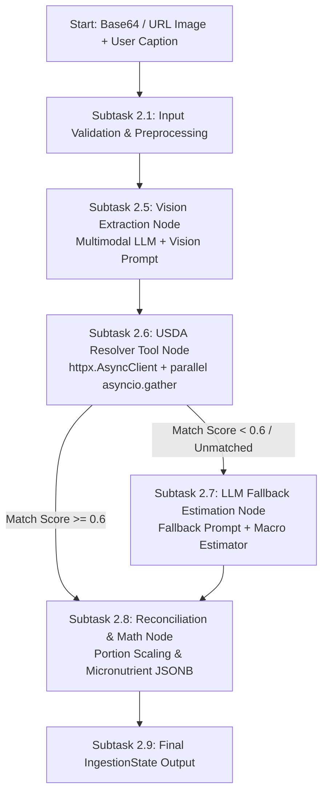

# Implementation Plan: Phase 2 — LangGraph Workflow 1 (Food Vision & USDA Resolver)

## Goal Description
Implement **Workflow 1: Food Vision & USDA Resolver**, a stateful LangGraph ingestion pipeline for **Project Bite** based on [`specs/2_LANGGRAPH_WORKFLOW.md`](file:///home/jiggra/bite-backend/specs/2_LANGGRAPH_WORKFLOW.md).

This pipeline processes food image payloads (base64 or URL) and optional text captions through:
1. Multimodal LLM Vision Extraction to identify food items, portion estimates in grams, and cooking methods.
2. Asynchronous USDA FoodData Central Search (`Foundation` and `SR Legacy` datasets) to retrieve per-100g nutrient profiles.
3. LLM Fallback Estimation for unmatched or low-confidence food items.
4. Nutrient Reconciliation & Scaling to compute portion-scaled calories, macros (protein, carbs, fat), and full micronutrient spectrum JSONB dictionaries.
5. Unit Test Suite (2 tests) verifying graph execution, portion math, and fallback resilience.

---

## User Review Required

> [!IMPORTANT]
> **API Keys & Model Selection**
> * **USDA API Key:** Loaded via environment variable `USDA_API_KEY` in `app/core/config.py` (defaults to `"DEMO_KEY"` for development/testing).
> * **Vision LLM Model:** Uses `langchain-google-genai` (`gemini-2.0-flash`) or `langchain-openai` (`gpt-4o`) configured in `app/core/config.py`.
> * **Offline Test Guarantee:** Unit tests (`tests/test_ingestion_graph.py`) use `unittest.mock` to mock LLM calls and USDA HTTP network requests, guaranteeing 100% offline test execution without requiring API keys or network access during CI.

---

## Open Questions

> [!NOTE]
> 1. **Primary Vision LLM Provider:** Do you prefer Gemini (`gemini-2.0-flash` via `langchain-google-genai`) or OpenAI (`gpt-4o` via `langchain-openai`) as the default vision model?
> 2. **USDA Cache TTL:** Should we add an optional in-memory LRU cache (`async-lru`) for USDA API search queries in `app/tools/usda.py` to prevent redundant API calls for common foods?

---

## Ingestion Graph Workflow Architecture



---

## Detailed Subtask Implementation Plan

---

### Subtask 2.1: Core Configuration & Input Validation Settings

**File:** `app/core/config.py`  
**Purpose:** Update application settings to support USDA API and Vision LLM configurations.

#### Implementation Details:
* Add `USDA_API_KEY: str = "DEMO_KEY"`
* Add `USDA_API_BASE_URL: str = "https://api.nal.usda.gov/fdc/v1"`
* Add `VISION_LLM_MODEL: str = "gemini-2.0-flash"`
* Add validation helper function `validate_image_input(image_bytes: Optional[bytes], image_url: Optional[str]) -> str` to ensure either base64 or a valid URL is provided under 10MB payload size.

```python
# Code snippet specification for app/core/config.py updates
class Settings(BaseSettings):
    ...
    USDA_API_KEY: str = Field(default="DEMO_KEY", env="USDA_API_KEY")
    USDA_API_BASE_URL: str = Field(default="https://api.nal.usda.gov/fdc/v1", env="USDA_API_BASE_URL")
    VISION_LLM_MODEL: str = Field(default="gemini-2.0-flash", env="VISION_LLM_MODEL")
```

---

### Subtask 2.2: LangGraph State Definition (`IngestionState`)

**File:** `app/schemas/ingestion.py`  
**Purpose:** Define all `TypedDict` data structures that represent state passing between nodes in the LangGraph ingestion graph.

#### Implementation Details:
* `VisionItem`: Raw food item identified by the vision model.
* `USDANutrientProfile`: 100g nutrient profile fetched from USDA.
* `ReconciledItem`: Final scaled meal item formatted for database storage.
* `IngestionState`: Complete graph state reducer object.

```python
from typing import List, Dict, Any, Optional
from typing_extensions import TypedDict

class VisionItem(TypedDict):
    food_name: str
    portion_estimate: str
    gram_weight: float
    cooking_method: Optional[str]

class USDANutrientProfile(TypedDict):
    fdc_id: int
    food_description: str
    calories_100g: float
    protein_100g: float
    carbs_100g: float
    fat_100g: float
    micronutrients_100g: Dict[str, float]  # e.g., {"Vitamin C (mg)": 12.5, "Calcium (mg)": 150.0}

class ReconciledItem(TypedDict):
    food_name: str
    fdc_id: Optional[int]
    portion_amount: float
    portion_unit: str
    gram_weight: float
    calories: float
    protein_g: float
    carbs_g: float
    fat_g: float
    is_fallback: bool
    raw_usda_nutrients: Dict[str, Any]

class IngestionState(TypedDict):
    # Node 1 Inputs
    image_bytes: Optional[bytes]
    image_url: Optional[str]
    user_caption: Optional[str]
    
    # Node 2 Outputs
    detected_items: List[VisionItem]
    vision_confidence: float
    
    # Node 3 Outputs
    usda_matches: Dict[str, Optional[USDANutrientProfile]]
    
    # Node 4 / Node 5 Outputs
    reconciled_items: List[ReconciledItem]
    total_calories: float
    total_protein_g: float
    total_carbs_g: float
    total_fat_g: float
    aggregated_nutrients: Dict[str, float]
    
    # Diagnostics & Warnings
    errors: List[str]
```

---

### Subtask 2.3: Pydantic Structured Output Models

**File:** `app/schemas/ingestion.py`  
**Purpose:** Define Pydantic models for structured output extraction from LLM vision and fallback nodes.

#### Implementation Details:
* `ExtractedFoodItem`: Pydantic schema for individual food items detected in vision analysis.
* `VisionAnalysisResult`: Top-level Pydantic schema for the Vision Extraction LLM output.
* `FallbackMacroEstimate`: Pydantic schema for estimating per-100g nutrients when USDA data is unavailable.

```python
from pydantic import BaseModel, Field
from typing import List, Optional

class ExtractedFoodItem(BaseModel):
    food_name: str = Field(description="Specific name of the food item detected.")
    portion_estimate: str = Field(description="Human readable portion size, e.g., '1 cup', '150g', '2 slices'.")
    gram_weight: float = Field(description="Estimated total weight of portion in grams.", gt=0)
    cooking_method: Optional[str] = Field(default="raw", description="Preparation method, e.g., 'fried', 'boiled', 'grilled', 'raw'.")

class VisionAnalysisResult(BaseModel):
    detected_items: List[ExtractedFoodItem] = Field(description="Array of all food items detected in the image.")
    confidence_score: float = Field(description="Overall vision extraction confidence from 0.0 to 1.0.")

class FallbackMacroEstimate(BaseModel):
    food_name: str = Field(description="Name of the unlisted food item.")
    calories_100g: float = Field(description="Estimated calories per 100 grams.", ge=0)
    protein_100g: float = Field(description="Estimated protein in grams per 100g.", ge=0)
    carbs_100g: float = Field(description="Estimated carbohydrates in grams per 100g.", ge=0)
    fat_100g: float = Field(description="Estimated total fat in grams per 100g.", ge=0)
    estimated_micronutrients_100g: Dict[str, float] = Field(default_factory=dict, description="Key vitamins and minerals per 100g.")
```

---

### Subtask 2.4: System & User Prompts Management Module

**File:** `app/services/langgraph/prompts.py`  
**Purpose:** Centralize all system and user prompt templates for LLM nodes to enforce zero prompt scatter and clean maintenance.

#### Prompts Specification:

1. **`VISION_SYSTEM_PROMPT`**:
```text
You are an expert computer vision clinical nutritionist.
Your task is to analyze the provided image of a meal alongside any user caption.
Identify every distinct food component present, estimate its portion weight in grams, human-readable portion description, and preparation/cooking method.

User caption context: "{user_caption}"

Rules:
1. If user caption specifies a specific food variant (e.g. "whole wheat bread"), prioritize that over visual ambiguity.
2. Provide gram weights based on standard visual portion estimation guidelines.
3. Be precise with cooking methods (e.g., "deep-fried", "pan-seared", "steamed", "raw").
```

2. **`FALLBACK_SYSTEM_PROMPT`**:
```text
You are a USDA food database specialist and nutritional science expert.
A specific food item was not found in the USDA FoodData Central database.
Provide your best scientifically accurate estimation of its nutritional profile PER 100 GRAMS.

Food Item: {food_name}
Cooking Method: {cooking_method}

Provide per-100g values for Calories, Protein (g), Carbohydrates (g), Total Fat (g), and major micronutrients (Sodium mg, Potassium mg, Calcium mg, Iron mg, Vitamin C mg, Vitamin A mcg).
```

---

### Subtask 2.5: Vision Extraction Node (`vision_extraction_node`)

**File:** `app/services/langgraph/vision_node.py`  
**Purpose:** Implement the first graph node that receives image payload & caption, invokes multimodal LLM with structured output, and updates state `detected_items`.

#### Implementation Details:
* Function signature: `async def vision_extraction_node(state: IngestionState) -> Dict[str, Any]`
* Format image data URI (`data:image/jpeg;base64,...`) or HTTP image URL.
* Bind LLM with `llm.with_structured_output(VisionAnalysisResult)`.
* Invoke model and convert response into `List[VisionItem]`.
* Return updated state dictionary: `{"detected_items": detected_items, "vision_confidence": result.confidence_score}`.

---

### Subtask 2.6: Async USDA Resolver Tool & Node (`usda_resolver_node`)

**Files:** `app/tools/usda.py` and `app/services/langgraph/usda_node.py`  
**Purpose:** Implement asynchronous search tool against USDA API and the graph node that resolves food items to 100g nutrient profiles.

#### Implementation Details:

1. **`USDAService` (`app/tools/usda.py`)**:
   * `search_food(query: str, page_size: int = 3)`: Calls GET `${USDA_API_BASE_URL}/foods/search?api_key=${USDA_API_KEY}&query=${query}&dataType=Foundation,SR Legacy&pageSize=${page_size}` using `httpx.AsyncClient`.
   * `compute_match_score(query: str, description: str) -> float`: Token-set ratio / word overlap calculation.
   * `extract_100g_profile(usda_food: dict) -> USDANutrientProfile`: Extracts standard nutrient IDs (Energy: 1008/208, Protein: 1003/203, Carbs: 1005/205, Fat: 1004/204) and vitamin/mineral arrays.

2. **`usda_resolver_node` (`app/services/langgraph/usda_node.py`)**:
   * Function signature: `async def usda_resolver_node(state: IngestionState) -> Dict[str, Any]`
   * Execute parallel lookups for all `detected_items` using `asyncio.gather(*[usda_service.search_item(item) for item in state["detected_items"]])`.
   * Rank matches by match score. If top match $\ge 0.6$, store match profile in `usda_matches[item_name]`. Otherwise, set `usda_matches[item_name] = None`.

---

### Subtask 2.7: LLM Fallback Estimation Node (`fallback_node`)

**File:** `app/services/langgraph/fallback_node.py`  
**Purpose:** Handle items where USDA lookup returned no results or match score $< 0.6$.

#### Implementation Details:
* Function signature: `async def fallback_node(state: IngestionState) -> Dict[str, Any]`
* Iterate through `state["detected_items"]`. If `usda_matches[food_name]` is `None`:
  * Invoke LLM with `FALLBACK_SYSTEM_PROMPT` structured output (`FallbackMacroEstimate`).
  * Construct fallback `USDANutrientProfile` with `fdc_id = None`.
  * Store in `usda_matches[food_name]`.
  * Append warning entry to `state["errors"]` (e.g. `"USDA lookup failed for 'Alien Fruit'; used LLM fallback estimation."`).

---

### Subtask 2.8: Nutrient Reconciliation & Scaling Math Node (`reconciliation_node`)

**File:** `app/services/langgraph/scale_node.py`  
**Purpose:** Perform deterministic mathematical scaling of per-100g nutrient profiles to exact estimated gram weights and aggregate meal totals.

#### Implementation Math Details:
* For each item:
  \[
  \text{scale\_factor} = \frac{\text{gram\_weight}}{100.0}
  \]
  \[
  \text{item\_calories} = \text{round}(\text{calories\_100g} \times \text{scale\_factor}, 2)
  \]
  \[
  \text{item\_protein} = \text{round}(\text{protein\_100g} \times \text{scale\_factor}, 2)
  \]
  \[
  \text{item\_carbs} = \text{round}(\text{carbs\_100g} \times \text{scale\_factor}, 2)
  \]
  \[
  \text{item\_fat} = \text{round}(\text{fat\_100g} \times \text{scale\_factor}, 2)
  \]
* Aggregate totals:
  \[
  \text{total\_calories} = \sum \text{item\_calories}
  \]
* Micronutrient Aggregation:
  * Sum up all scaled micronutrients across items into a single `aggregated_nutrients` dictionary formatted for PostgreSQL JSONB storage in `public.meal_logs`.

---

### Subtask 2.9: LangGraph Workflow Assembly & Compilation

**File:** `app/services/langgraph/graph.py`  
**Purpose:** Assemble all nodes into a stateful `StateGraph`, define conditional routing edges, and export compiled runnable `ingestion_graph`.

#### Implementation Details:
* Instantiates `workflow = StateGraph(IngestionState)`
* Add Nodes: `vision_extraction`, `usda_resolver`, `fallback`, `reconciliation`.
* Define Entrypoint: `workflow.set_entry_point("vision_extraction")`
* Add Edges:
  * `vision_extraction` $\rightarrow$ `usda_resolver`
  * Conditional edge from `usda_resolver`:
    * Helper `def check_fallback_needed(state: IngestionState) -> str`: Returns `"fallback"` if any item in `usda_matches` is `None`, else returns `"reconciliation"`.
  * `fallback` $\rightarrow$ `reconciliation`
  * `reconciliation` $\rightarrow$ `END`
* Export `ingestion_graph = workflow.compile()`

```python
# Workflow StateGraph Blueprint
workflow = StateGraph(IngestionState)
workflow.add_node("vision_extraction", vision_extraction_node)
workflow.add_node("usda_resolver", usda_resolver_node)
workflow.add_node("fallback", fallback_node)
workflow.add_node("reconciliation", reconciliation_node)

workflow.set_entry_point("vision_extraction")
workflow.add_edge("vision_extraction", "usda_resolver")
workflow.add_conditional_edges(
    "usda_resolver",
    check_fallback_needed,
    {
        "fallback": "fallback",
        "reconciliation": "reconciliation"
    }
)
workflow.add_edge("fallback", "reconciliation")
workflow.add_edge("reconciliation", END)
ingestion_graph = workflow.compile()
```

---

### Subtask 2.10: Automated Unit Testing Suite (`tests/test_ingestion_graph.py`)

**File:** `tests/test_ingestion_graph.py`  
**Purpose:** Implement exactly 2 unit tests verifying end-to-end graph execution, math scaling, and fallback handling using mocked external services.

#### Test Specifications:

1. **Test 1: `test_ingestion_graph_success`**
   * **Mock Setup:** 
     * Mock Vision LLM returning 2 items: 150g Grilled Chicken Breast, 100g Steamed Broccoli.
     * Mock USDA API returning 100g profiles (Chicken: 165 kcal, 31g protein, 0g carbs, 3.6g fat; Broccoli: 34 kcal, 2.8g protein, 7g carbs, 0.4g fat).
   * **Assertions:**
     * `len(result["reconciled_items"]) == 2`
     * Scaled Chicken calories == 247.5 ($165 \times 1.5$)
     * Total calories == 281.5 ($247.5 + 34$)
     * `result["reconciled_items"][0]["is_fallback"] == False`
     * `result["aggregated_nutrients"]` contains vitamin/mineral keys.

2. **Test 2: `test_ingestion_graph_fallback`**
   * **Mock Setup:**
     * Mock Vision LLM returning 1 item: 200g "Dragonfruit Smoothie Bowl".
     * Mock USDA API returning empty list `[]` (0 search results).
     * Mock Fallback LLM returning per-100g fallback estimate (60 kcal, 1g protein, 14g carbs, 0.5g fat).
   * **Assertions:**
     * `result["reconciled_items"][0]["is_fallback"] == True`
     * Total calories == 120.0 ($60 \times 2.0$)
     * `len(result["errors"]) > 0` (contains fallback warning entry)
     * Graph execution finishes without unhandled exceptions.

---

## Verification Plan

### Automated Tests
Run pytest against the ingestion graph test suite:
```bash
.venv/bin/pytest -v tests/test_ingestion_graph.py
```

### Manual Verification
1. Test graph compilation import:
   ```bash
   .venv/bin/python -c "from app.services.langgraph.graph import ingestion_graph; print(ingestion_graph)"
   ```
2. Verify all 2 unit tests pass cleanly without requiring live network access or consuming API tokens.
