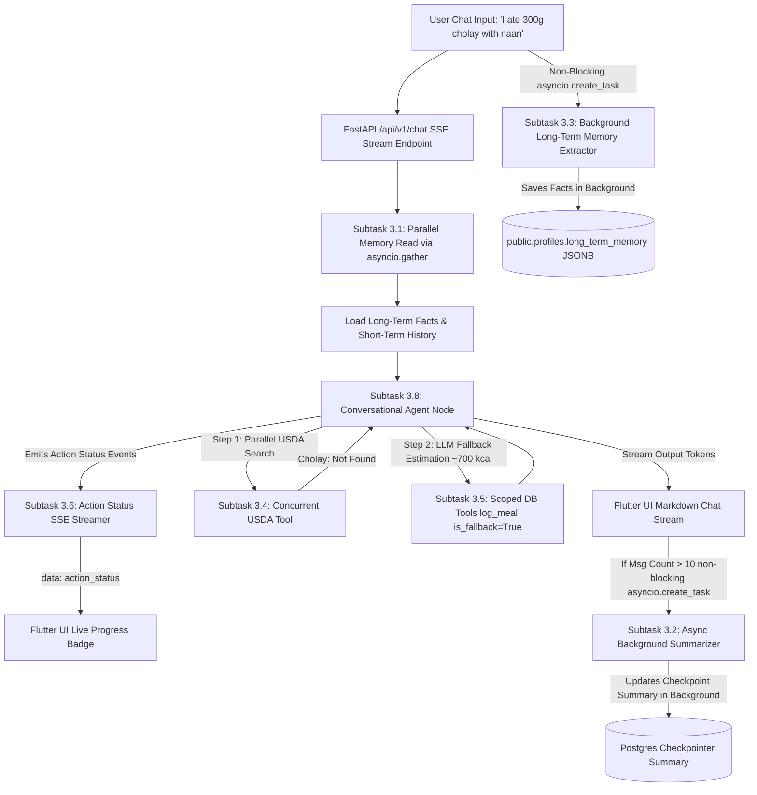

# Implementation Plan: Phase 3 — LangGraph Workflow 2 (Conversational CRUD, Dual Memory, Regional Dish Fallback, Action Status Streaming & Ultra-Low Latency Architecture)

**Status:** Completed  
**Completed At:** 2026-08-24T14:57:30+05:00
Implement **Workflow 2: Conversational CRUD, Text-Based Meal Logging & Dual-Memory Agent**, the interactive conversational intelligence engine for **Project Bite** based on [`specs/3_LANGGRAPH_WORKFLOW_2.md`](file:///home/jiggra/bite-backend/specs/3_LANGGRAPH_WORKFLOW_2.md).

This workflow allows users to:
1. Log meals via natural language (e.g., *"I ate 2 eggs and half plate of boiled rice"*, *"Add yesterday dinner I ate 0.5kg fried chicken"*, or *"I ate 300g cholay with naan"*).
2. Execute parallel USDA API lookups (`asyncio.gather`) and automated portion estimation.
3. Handle **Regional & Unmatched Dishes (e.g. Cholay with Naan, Biryani)** via internal LLM fallback estimation (`is_fallback=True`) when USDA database lacks entries.
4. Stream real-time **Action Status** events over SSE to Flutter (e.g. *"Estimating portions..."*, *"Searching USDA database & calculating regional estimates..."*, *"Saving to your log..."*).
5. Persist multi-tenant chat memory via `AsyncPostgresSaver` with **100% Non-Blocking Short-Term Memory Auto-Summarization** (`asyncio.create_task`).
6. Extract and inject **Long-Term Memory Facts** asynchronously via **Non-Blocking Background Tasks** (<0.1ms direct context injection).
7. Perform fast, GIN-indexed JSONB analytics queries (`get_daily_summary`, `get_micronutrient_total`) and CRUD mutations (`update_meal_item`, `delete_meal_log`).

---

## User Review Required

> [!IMPORTANT]
> **Regional Dish LLM Fallback Strategy (Graceful Degradation)**
> * When a user logs traditional or cultural foods (e.g., *cholay*, *naan*, *biryani*, *nihari*) not found in USDA FoodData Central, the workflow **never fails or crashes**.
> * The LLM estimates portion weights, calories, and macros using its internal culinary knowledge and logs the meal with `is_fallback: true` to PostgreSQL.
> * The response to the user clearly indicates that estimated values were used.

---

## System Architecture Diagram (Parallel & Fallback Pipeline)



---

## Detailed Step-by-Step 10-Subtask Roadmap

---

### Subtask 3.1: Database Connection Pool & Parallel Memory Infrastructure
**File:** `app/services/langgraph_of_chatbot/checkpointer.py`  
**Purpose:** Configure LangGraph's `AsyncPostgresSaver` using the global `AsyncConnectionPool` and provide a parallel memory pre-fetch utility (`asyncio.gather`).

---

### Subtask 3.2: Short-Term Memory Manager & Non-Blocking Background Summarizer
**File:** `app/services/langgraph_of_chatbot/memory_short_term.py`  
**Purpose:** Instant RAM window slice (keeping latest 2–4 messages) and background task (`asyncio.create_task`) auto-summarizer when message count exceeds 10 user messages.

---

### Subtask 3.3: Non-Blocking Long-Term Memory Extractor & Direct Context Injector
**File:** `app/services/langgraph_of_chatbot/memory_long_term.py`  
**Purpose:** Extract user facts (allergies, diet preferences) in the background and provide instant (<0.1ms) direct context injection into system prompts.

---

### Subtask 3.4: Concurrent USDA API Tool with In-Memory LRU Cache & Fallback Handlers
**File:** `app/services/langgraph_of_chatbot/usda_tool.py`  
**Purpose:** Provide decorated `@tool` `search_usda_food` with in-memory caching (`cachetools.TTLCache`), parallel execution (`asyncio.gather`), and clean empty/unmatched responses for regional dishes.

---

### Subtask 3.5: Scoped Database CRUD & Micronutrient Analytics Tools
**File:** `app/services/langgraph_of_chatbot/db_tools.py`  
**Purpose:** Implement 5 tenant-isolated database tools (`log_meal`, `get_daily_summary`, `get_micronutrient_total`, `update_meal_item`, `delete_meal_log`) supporting `is_fallback=True` entries, parallel multi-nutrient lookups via `asyncio.gather()`, and automatic session `user_id` authentication binding for Zero-Trust tenant security.

---

### Subtask 3.6: Action Status SSE Streamer & Pydantic v2 Schemas
**File:** `app/schemas/agent_schemas.py` & `app/services/langgraph_of_chatbot/action_status_streamer.py`  
**Purpose:** Map LangGraph execution events to human-readable SSE JSON chunks (`action_status`) and define strict Pydantic v2 tool input schemas (`extra='forbid'`).

---

### Subtask 3.7: Agent System Prompt with Temporal, Regional Fallback & Grounding Context
**File:** `app/services/langgraph_of_chatbot/agent_prompts.py`  
**Purpose:** Author system prompt combining dynamic date/time, long-term memory facts, portion estimation rules, **regional dish fallback rules (*"cholay with naan"* $\rightarrow$ internal LLM estimation)**, and edibility guardrails (*"laptop" / "elephant"*).

---

### Subtask 3.8: Conversational State Graph & Multi-Tool Router Assembly
**File:** `app/services/langgraph_of_chatbot/agent_graph.py`  
**Purpose:** Assemble and compile the full LangGraph state machine with all 6 tools, checkpointer, and streaming runner.

---

### Subtask 3.9: Integration Test 1 (Meal Addition, Regional Fallback, Concurrent USDA & Status)
**File:** `tests/test_agent_workflow2_logging.py`  
**Purpose:** End-to-end async test verifying natural language meal logging for both standard foods (*eggs, rice*) and regional fallback foods (*"300g cholay with naan"*), verifying database persistence with `is_fallback=True` and action status events.

---

### Subtask 3.10: Integration Test 2 (Micronutrient Analytics, Long-Term Memory & Summarization)
**File:** `tests/test_agent_workflow2_analytics.py`  
**Purpose:** End-to-end async test verifying micronutrient JSONB queries, background long-term fact extraction, and message history summarization.

---

## Verification Plan

### Automated Tests
Execute the comprehensive Phase 3 test suite using pytest-asyncio:
```bash
.venv/bin/pytest tests/test_agent_workflow2_logging.py tests/test_agent_workflow2_analytics.py -v
```

### Manual Verification
1. Test regional dishes (*"300g cholay with naan"*) and verify graceful fallback estimation and DB logging.
2. Test relative dates (*"yesterday dinner"*) and verify correct date insertion in PostgreSQL.
3. Verify SSE stream outputs action status events (*"Searching USDA..."*, *"Saving meal..."*) in real time.
