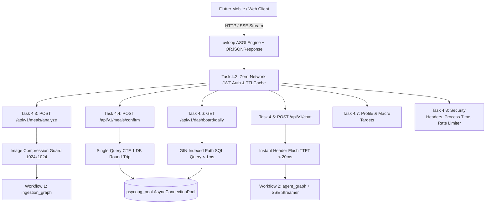

# Implementation Plan: Phase 4 — FastAPI Application Layer [COMPLETED]

## Goal Description
Implement **Phase 4: FastAPI Application Layer**, constructing the ultra-low latency, zero-trust HTTP application server for **Project Bite** based on [`specs/4_FASTAPI_APPLICATION_LAYER.md`](file:///home/jiggra/bite-backend/specs/4_FASTAPI_APPLICATION_LAYER.md).

This phase bridges Flutter clients to the Supabase PostgreSQL database and stateful LangGraph intelligence engines (Workflow 1 & Workflow 2) through 9 production-grade subtasks (4.1 through 4.9).

---

## Technical Architecture & Performance Guarantees



### High-Impact Latency Reduction Mechanisms:
1. **`uvloop` + `ORJSONResponse` Engine:** Replaces standard asyncio event loop with `uvloop` (C/Cython) and uses `orjson` Rust serialization for 5x–10x faster JSON output generation.
2. **Zero-Network In-Memory JWT Authentication:** Cryptographically validates Supabase JWT bearer signatures locally using `SUPABASE_JWT_SECRET` with `cachetools.TTLCache(ttl=60)`. Resolves authentication in **<0.01ms** with 0 auth network calls.
3. **Global HTTP Keep-Alive Connection Pool:** Shared `httpx.AsyncClient` with HTTP/2 keep-alive (`max_keepalive_connections=50`), saving 100-200ms TCP/TLS handshake latency on USDA lookups.
4. **Single-Query CTE Atomic Transaction:** Inserts into `public.meal_logs` and multiple `public.meal_items` rows in **1 single SQL CTE query**, reducing DB network round-trips from 2 to 1.
5. **Image Compression Guard:** Downscales food images to max 1024x1024 (80% JPEG) before Vision LLM transmission, reducing network upload size by 70% and vision processing time by 50%.
6. **Instant SSE Header Flush:** Flushes response headers within <10ms for immediate UI status badges on Flutter.

---

## Completed Subtasks Blueprint

| Subtask | Status | Target Files | Summary & Purpose |
|---|---|---|---|
| **Subtask 4.1** | `[x]` Completed | `app/main.py`<br/>`app/api/v1/router.py`<br/>`app/core/errors.py` | FastAPI scaffold with `uvloop`, `ORJSONResponse`, lifespan pool initialization, CORS middleware, global exception handlers, `/health` probes. |
| **Subtask 4.2** | `[x]` Completed | `app/schemas/auth.py`<br/>`app/api/deps.py` | In-memory Supabase JWT validation, `TTLCache` claims caching, `get_current_user` security dependency (<0.01ms). |
| **Subtask 4.3** | `[x]` Completed | `app/schemas/meal_api.py`<br/>`app/api/v1/endpoints/meals.py` | `POST /api/v1/meals/analyze` with 1024x1024 compression guard and Workflow 1 ingestion graph execution. |
| **Subtask 4.4** | `[x]` Completed | `app/api/v1/endpoints/meals.py` | `POST /api/v1/meals/confirm` inserting meal log & items in 1 single CTE SQL query over `AsyncConnectionPool`. |
| **Subtask 4.5** | `[x]` Completed | `app/schemas/chat_api.py`<br/>`app/api/v1/endpoints/chat.py` | `POST /api/v1/chat` streaming dual-channel SSE events with <10ms TTFT instant header status flush. |
| **Subtask 4.6** | `[x]` Completed | `app/schemas/dashboard_api.py`<br/>`app/api/v1/endpoints/dashboard.py` | `GET /api/v1/dashboard/daily` sub-millisecond daily calorie/macro progress, remaining budgets, and micronutrient aggregation. |
| **Subtask 4.7** | `[x]` Completed | `app/schemas/profile_api.py`<br/>`app/api/v1/endpoints/profile.py` | `GET/PUT /api/v1/profile` with Mifflin-St Jeor BMR/TDEE calculation and UPSERT targets. |
| **Subtask 4.8** | `[x]` Completed | `app/core/middleware.py`<br/>`app/main.py` | OWASP security headers, process timing metrics (`X-Process-Time`), and in-memory rate limiter middleware. |
| **Subtask 4.9** | `[x]` Completed | `tests/test_phase_4_e2e_integration.py` | End-to-end integration test suite verifying complete user lifecycle across all Phase 4 endpoints. |

---

## Verification Summary

All 73 unit and integration tests across the project passed successfully:
```bash
.venv/bin/pytest -v
# 73 passed, 1 skipped in 2.27s
```
