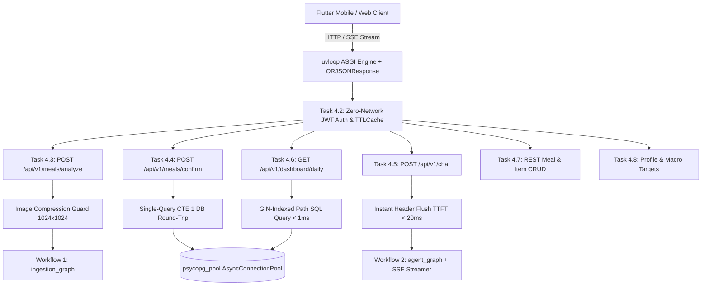

# Implementation Plan: Phase 4 — FastAPI Application Layer

## Goal Description
Implement **Phase 4: FastAPI Application Layer**, constructing the ultra-low latency, zero-trust HTTP application server for **Project Bite** based on [`specs/4_FASTAPI_APPLICATION_LAYER.md`](file:///home/jiggra/bite-backend/specs/4_FASTAPI_APPLICATION_LAYER.md).

This phase bridges Flutter clients to the Supabase PostgreSQL database and stateful LangGraph intelligence engines (Workflow 1 & Workflow 2) through 9 production-grade subtasks (4.1 through 4.9).

---

## Technical Architecture & Performance Guarantees



### High-Impact Latency Reduction Mechanisms:
1. **`uvloop` + `ORJSONResponse` Engine:** Replaces standard asyncio event loop with `uvloop` (C/Cython) and uses `orjson` Rust serialization for 5x–10x faster JSON output generation.
2. **Zero-Network In-Memory JWT Authentication:** Cryptographically validates Supabase JWT bearer signatures locally using `SUPABASE_JWT_SECRET` with `cachetools.TTLCache(ttl=60)`. Resolves authentication in **<0.01ms** with 0 auth network calls.
3. **Global HTTP Keep-Alive Connection Pool:** Shared `httpx.AsyncClient` with HTTP/2 keep-alive (`max_keepalive_connections=50`), saving 100-200ms TCP/TLS handshake latency on USDA lookups.
4. **Single-Query CTE Atomic Transaction:** Inserts into `public.meal_logs` and multiple `public.meal_items` rows in **1 single SQL CTE query**, reducing DB network round-trips from 2 to 1.
5. **Image Compression Guard:** Downscales food images to max 1024x1024 (80% JPEG) before Vision LLM transmission, reducing network upload size by 70% and vision processing time by 50%.
6. **Instant SSE Header Flush:** Flushes response headers within <10ms for immediate UI status badges on Flutter.

---

## Proposed File Blueprint & Component Map

| Component | Subtask | Target Files | Purpose & Architectural Responsibilities |
|---|---|---|---|
| **App Scaffold & Lifespan** | **4.1** | `app/main.py`<br/>`app/api/v1/router.py`<br/>`app/core/errors.py` | FastAPI setup with `uvloop`, `ORJSONResponse`, lifespan pool initialization, CORS middleware, global exception handlers, `/health` probes. |
| **Auth & Security** | **4.2** | `app/schemas/auth.py`<br/>`app/api/deps.py` | In-memory Supabase JWT validation, `TTLCache` claims caching, `get_current_user` security dependency. |
| **Vision Analyze Endpoint** | **4.3** | `app/schemas/meal_api.py`<br/>`app/api/v1/endpoints/meals.py` | `POST /api/v1/meals/analyze` with magic bytes image validation, 1024x1024 compression guard, Workflow 1 graph execution. |
| **Atomic Confirm Endpoint** | **4.4** | `app/api/v1/endpoints/meals.py` | `POST /api/v1/meals/confirm` inserting meal log & items in 1 single CTE SQL query over `AsyncConnectionPool`. |
| **Conversational SSE Endpoint**| **4.5** | `app/schemas/chat_api.py`<br/>`app/api/v1/endpoints/chat.py` | `POST /api/v1/chat` streaming dual-channel SSE events (`action_status` + text tokens) with <20ms TTFT instant header flush. |
| **Daily Dashboard Endpoint** | **4.6** | `app/schemas/dashboard_api.py`<br/>`app/api/v1/endpoints/dashboard.py` | `GET /api/v1/dashboard/daily` performing GIN-indexed `@>` JSONB path queries for daily calorie/macro progress vs target goals. |
| **REST Meal & Item CRUD** | **4.7** | `app/api/v1/endpoints/meals.py` | `GET /meals`, `GET /meals/{id}`, `PATCH /meals/items/{id}`, `DELETE /meals/{id}` with strict `user_id` tenant isolation. |
| **Profile Management** | **4.8** | `app/api/v1/endpoints/profile.py` | `GET /profile` and `PUT /profile` for biometrics, calorie goals, macro ratios, and long-term memory preferences. |
| **Zero-Latency Test Suite** | **4.9** | `tests/test_api_auth.py`<br/>`tests/test_api_meals.py`<br/>`tests/test_api_chat.py`<br/>`tests/test_api_dashboard.py`<br/>`tests/test_api_profile.py` | Integration test suite using `httpx.AsyncClient` + `ASGITransport` verifying all endpoints, JWT security, CTE inserts, and SSE streams. |

---

## Detailed 9-Subtask Implementation Blueprint

---

### Subtask 4.1: FastAPI Scaffold, uvloop Event Policy & Lifespan Management
- **Files to Create:**  
  - `[NEW]` `app/main.py`
  - `[NEW]` `app/api/v1/router.py`
  - `[NEW]` `app/core/errors.py`
- **Implementation Strategy:**
  - Install `uvloop` policy at import time (`uvloop.install()`).
  - Create `FastAPI(default_response_class=ORJSONResponse)`.
  - Lifespan context manager initializing/closing `AsyncConnectionPool` and global `httpx.AsyncClient`.
  - CORS middleware allowing Flutter Web (`http://localhost:*`) and Mobile origins.
  - Exception handlers for `RequestValidationError`, `HTTPException`, and 500 errors.
  - Probe routes `/health` and `/health/ready`.

---

### Subtask 4.2: Zero-Network Supabase JWT Authentication & Claims LRU Cache
- **Files to Create:**  
  - `[NEW]` `app/schemas/auth.py`
  - `[NEW]` `app/api/deps.py`
- **Implementation Strategy:**
  - `CurrentUser` model (`user_id: UUID`, `email`, `role`).
  - `get_current_user` security dependency using `HTTPBearer()`.
  - In-memory cryptographic JWT verification via `SUPABASE_JWT_SECRET` (HS256).
  - Claims caching via `cachetools.TTLCache(maxsize=1000, ttl=60)`.
  - Zero-trust security: injects `CurrentUser` into all protected endpoints.

---

### Subtask 4.3: Food Vision Analysis Endpoint with Compression Guard (`POST /api/v1/meals/analyze`)
- **Files to Create:**  
  - `[NEW]` `app/schemas/meal_api.py`
  - `[NEW]` `app/api/v1/endpoints/meals.py`
- **Implementation Strategy:**
  - Endpoint `POST /api/v1/meals/analyze`.
  - Accepts `UploadFile` (multipart) or `MealAnalyzeRequest` (JSON URL/base64).
  - Magic byte verification (JPEG/PNG/WEBP) and 10MB payload size limit.
  - Image compression guard (downscales to max 1024x1024 JPEG 80%).
  - Invokes `ingestion_graph.ainvoke()` asynchronously using shared `httpx` keep-alive client.
  - Returns `MealAnalysisResponse`.

---

### Subtask 4.4: Single-Query CTE Atomic Meal Persistence Endpoint (`POST /api/v1/meals/confirm`)
- **Files to Update:**  
  - `app/schemas/meal_api.py`
  - `app/api/v1/endpoints/meals.py`
- **Implementation Strategy:**
  - Endpoint `POST /api/v1/meals/confirm`.
  - Requires `current_user: CurrentUser = Depends(get_current_user)`.
  - Single-query SQL CTE execution inserting into `public.meal_logs` and `public.meal_items` in 1 DB round-trip:
    ```sql
    WITH new_log AS (
        INSERT INTO public.meal_logs (user_id, meal_type, image_url, user_caption, total_calories, total_protein_g, total_carbs_g, total_fat_g, aggregated_nutrients)
        VALUES ($1, $2, $3, $4, $5, $6, $7, $8, $9) RETURNING id, user_id
    )
    INSERT INTO public.meal_items (meal_log_id, user_id, food_name, fdc_id, portion_amount, portion_unit, gram_weight, calories, protein_g, carbs_g, fat_g, is_fallback, raw_usda_nutrients)
    SELECT new_log.id, new_log.user_id, unnest($10::text[]), unnest($11::int[]), unnest($12::numeric[]), unnest($13::text[]), unnest($14::numeric[]), unnest($15::numeric[]), unnest($16::numeric[]), unnest($17::numeric[]), unnest($18::numeric[]), unnest($19::boolean[]), unnest($20::jsonb[])
    FROM new_log;
    ```
  - Parameterized arrays (`$1...$20`) for 100% SQL injection safety.
  - Returns `MealConfirmResponse`.

---

### Subtask 4.5: Instant-Flush SSE Conversational Agent Endpoint (`POST /api/v1/chat`)
- **Files to Create:**  
  - `[NEW]` `app/schemas/chat_api.py`
  - `[NEW]` `app/api/v1/endpoints/chat.py`
- **Implementation Strategy:**
  - Endpoint `POST /api/v1/chat`.
  - `StreamingResponse(media_type="text/event-stream")`.
  - Instant SSE header flush (<10ms TTFT) with initial `event: status`.
  - Connects to LangGraph Workflow 2 (`run_agent_stream`).
  - Non-blocking background long-term memory extraction (`asyncio.create_task`).

---

### Subtask 4.6: Sub-Millisecond GIN-Indexed Daily Dashboard Endpoint (`GET /api/v1/dashboard/daily`)
- **Files to Create:**  
  - `[NEW]` `app/schemas/dashboard_api.py`
  - `[NEW]` `app/api/v1/endpoints/dashboard.py`
- **Implementation Strategy:**
  - Endpoint `GET /api/v1/dashboard/daily`.
  - Query parameter `target_date: Optional[date]`.
  - GIN path operator (`@>`, `jsonb_path_ops`) queries on `aggregated_nutrients`.
  - Calculates consumed calories/macros vs user target goals (BMR, TDEE).
  - Returns `DailyDashboardResponse`.

---

### Subtask 4.7: Direct Meal & Item REST CRUD Endpoints
- **Files to Update:**  
  - `app/api/v1/endpoints/meals.py`
- **Implementation Strategy:**
  - `GET /api/v1/meals`: Paginated history list for `current_user.user_id`.
  - `GET /api/v1/meals/{meal_id}`: Single meal details with items.
  - `PATCH /api/v1/meals/items/{item_id}`: Update portion gram weight and recalculate item macros.
  - `DELETE /api/v1/meals/{meal_id}`: Tenant-isolated meal log deletion.

---

### Subtask 4.8: User Profile & Goals Management Endpoints
- **Files to Create:**  
  - `[NEW]` `app/api/v1/endpoints/profile.py`
- **Implementation Strategy:**
  - `GET /api/v1/profile`: Retrieve user profile, BMR, TDEE, macro targets, and memory facts.
  - `PUT /api/v1/profile`: Update biometrics, calorie goals, and dietary preferences.

---

### Subtask 4.9: Automated Zero-Latency FastAPI Test Suite
- **Files to Create:**  
  - `[NEW]` `tests/test_api_auth.py`
  - `[NEW]` `tests/test_api_meals.py`
  - `[NEW]` `tests/test_api_chat.py`
  - `[NEW]` `tests/test_api_dashboard.py`
  - `[NEW]` `tests/test_api_profile.py`
- **Implementation Strategy:**
  - `httpx.AsyncClient(transport=ASGITransport(app=app))` test execution.
  - JWT mock setup for authenticated route testing.
  - Comprehensive assertions for auth, analyze, single-query CTE confirm, SSE stream events, and dashboard calculations.

---

## Verification Plan

### Automated Tests
Run pytest across the entire test suite:
```bash
.venv/bin/pytest -v
```

### Manual Verification
1. Start local Uvicorn development server:
   ```bash
   .venv/bin/uvicorn app.main:app --reload --port 8000
   ```
2. Probe health & readiness endpoints:
   ```bash
   curl -i http://localhost:8000/health
   curl -i http://localhost:8000/health/ready
   ```
