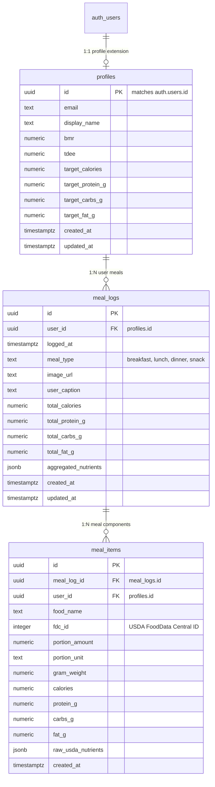

# Technical Specification: Phase 1 — Database Setup (Supabase / PostgreSQL)

**Task ID:** Phase 1 (Tasks 1.1, 1.2, 1.3, 1.4)  
**Title:** Database Setup & Core Schema Architecture  
**Feature Branch:** `feature/phase-1-database-setup`  
**Status:** In Progress  

---

## 1. Executive Goal & Architectural Overview

The goal of Phase 1 is to establish a secure, performant, and scale-ready relational database foundation on PostgreSQL (Supabase). The schema supports **Project Bite**, a photo-first AI calorie and micronutrient tracker powered by LangGraph.

### Key Architectural Pillars:
1. **Normalized Core Relational Entities:** `profiles`, `meal_logs`, and `meal_items`.
2. **Flexible JSONB Document Storage:** `aggregated_nutrients` in `meal_logs` and `raw_usda_nutrients` in `meal_items` store full micronutrient spectrums (vitamins, minerals, amino acids) without rigid schema alterations.
3. **Sub-Millisecond Query Performance:** GIN (Generalized Inverted Index) path indexing on JSONB fields enabling high-speed micronutrient queries across thousands of meal entries.
4. **Zero-Trust Multi-Tenancy (RLS):** Strict Row Level Security (RLS) linked directly to Supabase `auth.users` (`auth.uid()`) to guarantee strict isolation between user accounts.

---

## 2. Database Schema Blueprint



---

## 3. Data Definition Language (DDL) Specifications

### A. Core Extensions & Functions
```sql
CREATE EXTENSION IF NOT EXISTS "uuid-ossp";

-- Auto-update updated_at timestamp function
CREATE OR REPLACE FUNCTION update_updated_at_column()
RETURNS TRIGGER AS $$
BEGIN
    NEW.updated_at = CURRENT_TIMESTAMP;
    RETURN NEW;
END;
$$ language 'plpgsql';
```

### B. Table `public.profiles`
```sql
CREATE TABLE IF NOT EXISTS public.profiles (
    id UUID PRIMARY KEY, -- References Supabase auth.users(id)
    email TEXT UNIQUE NOT NULL,
    display_name TEXT,
    bmr NUMERIC(7,2) CHECK (bmr > 0),
    tdee NUMERIC(7,2) CHECK (tdee > 0),
    target_calories NUMERIC(7,2) CHECK (target_calories > 0),
    target_protein_g NUMERIC(6,2) CHECK (target_protein_g >= 0),
    target_carbs_g NUMERIC(6,2) CHECK (target_carbs_g >= 0),
    target_fat_g NUMERIC(6,2) CHECK (target_fat_g >= 0),
    created_at TIMESTAMPTZ NOT NULL DEFAULT CURRENT_TIMESTAMP,
    updated_at TIMESTAMPTZ NOT NULL DEFAULT CURRENT_TIMESTAMP
);

CREATE TRIGGER update_profiles_updated_at
    BEFORE UPDATE ON public.profiles
    FOR EACH ROW
    EXECUTE FUNCTION update_updated_at_column();
```

### C. Table `public.meal_logs`
```sql
CREATE TABLE IF NOT EXISTS public.meal_logs (
    id UUID PRIMARY KEY DEFAULT gen_random_uuid(),
    user_id UUID NOT NULL REFERENCES public.profiles(id) ON DELETE CASCADE,
    logged_at TIMESTAMPTZ NOT NULL DEFAULT CURRENT_TIMESTAMP,
    meal_type TEXT NOT NULL CHECK (meal_type IN ('breakfast', 'lunch', 'dinner', 'snack')),
    image_url TEXT,
    user_caption TEXT,
    total_calories NUMERIC(7,2) DEFAULT 0 CHECK (total_calories >= 0),
    total_protein_g NUMERIC(6,2) DEFAULT 0 CHECK (total_protein_g >= 0),
    total_carbs_g NUMERIC(6,2) DEFAULT 0 CHECK (total_carbs_g >= 0),
    total_fat_g NUMERIC(6,2) DEFAULT 0 CHECK (total_fat_g >= 0),
    aggregated_nutrients JSONB NOT NULL DEFAULT '{}'::jsonb,
    created_at TIMESTAMPTZ NOT NULL DEFAULT CURRENT_TIMESTAMP,
    updated_at TIMESTAMPTZ NOT NULL DEFAULT CURRENT_TIMESTAMP
);

CREATE TRIGGER update_meal_logs_updated_at
    BEFORE UPDATE ON public.meal_logs
    FOR EACH ROW
    EXECUTE FUNCTION update_updated_at_column();
```

### D. Table `public.meal_items`
```sql
CREATE TABLE IF NOT EXISTS public.meal_items (
    id UUID PRIMARY KEY DEFAULT gen_random_uuid(),
    meal_log_id UUID NOT NULL REFERENCES public.meal_logs(id) ON DELETE CASCADE,
    user_id UUID NOT NULL REFERENCES public.profiles(id) ON DELETE CASCADE,
    food_name TEXT NOT NULL,
    fdc_id INTEGER,
    portion_amount NUMERIC(6,2) DEFAULT 1.0 CHECK (portion_amount > 0),
    portion_unit TEXT DEFAULT 'serving',
    gram_weight NUMERIC(7,2) CHECK (gram_weight > 0),
    calories NUMERIC(7,2) DEFAULT 0 CHECK (calories >= 0),
    protein_g NUMERIC(6,2) DEFAULT 0 CHECK (protein_g >= 0),
    carbs_g NUMERIC(6,2) DEFAULT 0 CHECK (carbs_g >= 0),
    fat_g NUMERIC(6,2) DEFAULT 0 CHECK (fat_g >= 0),
    raw_usda_nutrients JSONB NOT NULL DEFAULT '{}'::jsonb,
    created_at TIMESTAMPTZ NOT NULL DEFAULT CURRENT_TIMESTAMP
);
```

---

## 4. Performance Optimization & GIN Indexing

To support fast micronutrient aggregations and time-series queries:

```sql
-- Standard Relational B-Tree Indexes
CREATE INDEX IF NOT EXISTS idx_meal_logs_user_id ON public.meal_logs(user_id);
CREATE INDEX IF NOT EXISTS idx_meal_logs_logged_at ON public.meal_logs(logged_at DESC);
CREATE INDEX IF NOT EXISTS idx_meal_items_meal_log_id ON public.meal_items(meal_log_id);
CREATE INDEX IF NOT EXISTS idx_meal_items_user_id ON public.meal_items(user_id);
CREATE INDEX IF NOT EXISTS idx_meal_items_fdc_id ON public.meal_items(fdc_id);

-- GIN Indexes on JSONB Columns for Micronutrient Path Search
CREATE INDEX IF NOT EXISTS idx_meal_logs_aggregated_nutrients_gin 
    ON public.meal_logs USING GIN (aggregated_nutrients jsonb_path_ops);

CREATE INDEX IF NOT EXISTS idx_meal_items_raw_usda_nutrients_gin 
    ON public.meal_items USING GIN (raw_usda_nutrients jsonb_path_ops);
```

---

## 5. Security & Row Level Security (RLS) Policies

Row Level Security ensures multi-tenant data isolation at the database layer.

```sql
-- Enable RLS on all public tables
ALTER TABLE public.profiles ENABLE ROW LEVEL SECURITY;
ALTER TABLE public.meal_logs ENABLE ROW LEVEL SECURITY;
ALTER TABLE public.meal_items ENABLE ROW LEVEL SECURITY;

-- Profiles Policies
CREATE POLICY "Users can view own profile" 
    ON public.profiles FOR SELECT 
    USING (auth.uid() = id);

CREATE POLICY "Users can update own profile" 
    ON public.profiles FOR UPDATE 
    USING (auth.uid() = id);

CREATE POLICY "Users can insert own profile" 
    ON public.profiles FOR INSERT 
    WITH CHECK (auth.uid() = id);

-- Meal Logs Policies
CREATE POLICY "Users can view own meal logs" 
    ON public.meal_logs FOR SELECT 
    USING (auth.uid() = user_id);

CREATE POLICY "Users can insert own meal logs" 
    ON public.meal_logs FOR INSERT 
    WITH CHECK (auth.uid() = user_id);

CREATE POLICY "Users can update own meal logs" 
    ON public.meal_logs FOR UPDATE 
    USING (auth.uid() = user_id);

CREATE POLICY "Users can delete own meal logs" 
    ON public.meal_logs FOR DELETE 
    USING (auth.uid() = user_id);

-- Meal Items Policies
CREATE POLICY "Users can view own meal items" 
    ON public.meal_items FOR SELECT 
    USING (auth.uid() = user_id);

CREATE POLICY "Users can insert own meal items" 
    ON public.meal_items FOR INSERT 
    WITH CHECK (auth.uid() = user_id);

CREATE POLICY "Users can update own meal items" 
    ON public.meal_items FOR UPDATE 
    USING (auth.uid() = user_id);

CREATE POLICY "Users can delete own meal items" 
    ON public.meal_items FOR DELETE 
    USING (auth.uid() = user_id);
```

---

## 6. Implementation & Migration Blueprint

1. Save DDL migration script to `migrations/001_initial_schema.sql`.
2. Create database migration runner `app/db/migrate.py` utilizing `asyncpg` / `psycopg3`.
3. Execute schema migration against the PostgreSQL instance.
4. Execute verification tests (`tests/test_db_schema.py`) to confirm table existence, GIN index registration, constraint enforcement, and async query response.
