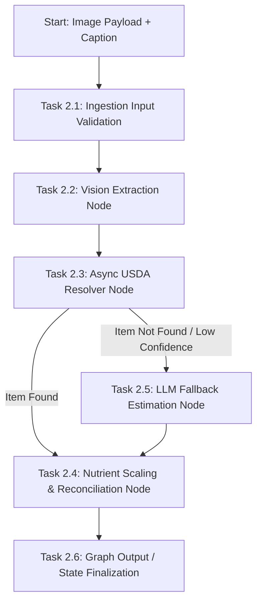

# Technical Specification: Phase 2 — LangGraph Workflow 1 (Food Vision & USDA Resolver)

**Task ID:** Phase 2 (Tasks 2.1, 2.2, 2.3, 2.4, 2.5, 2.6)  
**Title:** Food Vision Extraction, USDA Resolver, & Nutrient Reconciliation Ingestion Graph  
**Feature Branch:** `feature/phase-2-langgraph-workflow`  
**Status:** In Specification  

---

## 1. Executive Goal & Architectural Overview

The goal of Phase 2 is to design and implement **Workflow 1: Food Vision & USDA Resolver**, a stateful LangGraph ingestion pipeline. This workflow transforms user food images and optional text captions into structured, high-precision nutritional profiles scaled by portion size and normalized with USDA FoodData Central data.

### Key Architectural Pillars:
1. **Multimodal Food Perception (Vision Extraction Node):** Leverages a multimodal LLM (Gemini / OpenAI Vision) with structured output schema enforcement to extract discrete food items, estimated gram weights, and preparation/cooking methods from image payloads.
2. **High-Accuracy USDA Resolution (USDA Tool Node):** Performs concurrent, async query lookups against the USDA FoodData Central API (`Foundation` and `SR Legacy` databases) to retrieve exact per-100g nutrient profiles.
3. **Mathematical Reconciliation & Scaling (Nutrient Scaling Node):** Computes exact portion-scaled macros and compiles complete micronutrient spectrums into PostgreSQL JSONB-compatible structures.
4. **Graceful Degradation & LLM Fallback (Fallback Node):** Handles network timeouts, low-confidence searches, or unlisted foods by falling back to visual LLM macro estimations without crashing the pipeline.
5. **Non-Blocking Asynchronous Graph Architecture:** Engineered with `pytest-asyncio`, `httpx.AsyncClient`, and parallel asynchronous batch processing (`asyncio.gather`) for sub-second execution latency.

---

## 2. Ingestion Graph Architecture



---

## 3. Data Schemas & State Definition

### A. State Schema (`IngestionState`)

The graph state flows through all nodes as an immutable/reducer-driven `TypedDict`:

```python
from typing import List, Dict, Any, Optional
from typing_extensions import TypedDict

class VisionItem(TypedDict):
    food_name: str
    portion_estimate: str
    gram_weight: float
    cooking_method: Optional[str]

class USDANutrientProfile(TypedDict):
    fdc_id: int
    food_description: str
    calories_100g: float
    protein_100g: float
    carbs_100g: float
    fat_100g: float
    micronutrients_100g: Dict[str, float]  # e.g., {"Vitamin C": 12.5, "Calcium": 150.0}

class ReconciledItem(TypedDict):
    food_name: str
    fdc_id: Optional[int]
    portion_amount: float
    portion_unit: str
    gram_weight: float
    calories: float
    protein_g: float
    carbs_g: float
    fat_g: float
    is_fallback: bool
    raw_usda_nutrients: Dict[str, Any]

class IngestionState(TypedDict):
    # Inputs (Task 2.1)
    image_bytes: Optional[bytes]
    image_url: Optional[str]
    user_caption: Optional[str]
    
    # Task 2.2 Output
    detected_items: List[VisionItem]
    
    # Task 2.3 Output
    usda_matches: Dict[str, Optional[USDANutrientProfile]]
    
    # Task 2.4 & 2.5 Output
    reconciled_items: List[ReconciledItem]
    total_calories: float
    total_protein_g: float
    total_carbs_g: float
    total_fat_g: float
    aggregated_nutrients: Dict[str, float]
    
    # Execution Metadata & Errors
    errors: List[str]
```

### B. Pydantic Models for Multimodal LLM Structured Output

```python
from pydantic import BaseModel, Field
from typing import List, Optional

class ExtractedFoodItem(BaseModel):
    food_name: str = Field(description="Name of the food item detected in the image.")
    portion_estimate: str = Field(description="Human readable portion size, e.g., '1 cup', '150g', '2 slices'.")
    gram_weight: float = Field(description="Estimated total weight in grams.", gt=0)
    cooking_method: Optional[str] = Field(default="unknown", description="Preparation method, e.g., 'fried', 'raw', 'grilled'.")

class VisionAnalysisResult(BaseModel):
    detected_items: List[ExtractedFoodItem] = Field(description="List of all food items identified in the image.")
    confidence_score: float = Field(description="Overall vision confidence score between 0.0 and 1.0.")
```

---

## 4. Technical Blueprint & Node Specifications

### Task 2.1: Input Schema & Validation Layer
- **Input:** `image_bytes` (or `image_url`) + `user_caption` (optional string).
- **Validation Rules:**
  - Standardize image inputs into base64 format or verified HTTP URL.
  - Enforce maximum image payload size (10 MB limit).
  - Sanitize user text inputs to prevent prompt injection.

### Task 2.2: Vision Extraction Node (`vision_extraction_node`)
- **Model:** Multimodal LLM (Gemini 1.5/2.0 or OpenAI GPT-4o).
- **Behavior:**
  - Formulate structured prompt incorporating user caption for disambiguation (e.g. caption: "whole wheat bread" clarifies generic white slice).
  - Execute LLM with `with_structured_output(VisionAnalysisResult)`.
  - Append extracted items to graph state `detected_items`.

### Task 2.3: Async USDA Resolver Tool Node (`usda_resolver_node`)
- **API Target:** `https://api.nal.usda.gov/fdc/v1/foods/search`
- **Execution:**
  - Issue asynchronous batch lookups (`asyncio.gather`) using `httpx.AsyncClient`.
  - Filter parameters: `dataType=["Foundation", "SR Legacy"]`, `pageSize=3`.
  - Rank results using word-token match score between item `food_name` + `cooking_method` and USDA `description`.
  - If top match score $\ge 0.6$, store match profile in `usda_matches[food_name]`. Otherwise, set `usda_matches[food_name] = None` to trigger fallback.

### Task 2.4: Nutrient Reconciliation & Scaling Node (`reconciliation_node`)
- **Mathematical Scaling Formulas:**
  \[
  \text{scale\_factor} = \frac{\text{gram\_weight}}{100.0}
  \]
  \[
  \text{calories} = \text{calories\_100g} \times \text{scale\_factor}
  \]
  \[
  \text{protein\_g} = \text{protein\_100g} \times \text{scale\_factor}
  \]
  \[
  \text{carbs\_g} = \text{carbs\_100g} \times \text{scale\_factor}
  \]
  \[
  \text{fat\_g} = \text{fat\_100g} \times \text{scale\_factor}
  \]
- **Micronutrient Aggregation:**
  - Multiply all micronutrient values (Vitamins A/C/D/E/K, Calcium, Iron, Potassium, Magnesium, Zinc, Sodium) by `scale_factor`.
  - Aggregate micronutrients across all meal items into single `aggregated_nutrients` dictionary for `meal_logs` persistence.

### Task 2.5: Fallback Handling Node (`fallback_node`)
- **Condition:** Triggered for items where `usda_matches[food_name]` is `None` or API request timed out.
- **Behavior:**
  - Execute LLM fallback query requesting estimated macro profile (per 100g and for estimated gram weight) based on general food category knowledge.
  - Set `is_fallback = True` in `ReconciledItem` for audit transparency.
  - Log warning in `errors` list.

### Task 2.6: Unit Testing Requirements (Strict limit: 2 tests)
1. `test_ingestion_graph_success`:
   - Mock LLM vision output and mock USDA API response.
   - Assert graph completes execution, correctly scales macros for 2 items, and generates correct total calories and aggregated micronutrients.
2. `test_ingestion_graph_fallback`:
   - Mock USDA API returning 0 results for an obscure item.
   - Assert graph falls back gracefully, marks item `is_fallback = True`, and returns non-zero estimated calories without raising an exception.

---

## 5. Security & Performance Standards

- **Security:**
  - Never hardcode API keys (`USDA_API_KEY`, `OPENAI_API_KEY`, `GEMINI_API_KEY`). Load from `app.core.config.settings`.
  - Sanitize image bytes and URLs before external transmission.
- **Performance:**
  - Use single `httpx.AsyncClient` session instance for all USDA API requests.
  - Execute parallel searches using `asyncio.gather()` to ensure maximum 1.5s latency for multi-item meal analysis.
  - Enforce timeouts (5s max for USDA API, 10s max for Vision LLM).

---

## 6. Target Directory & File Structure Blueprint

```text
app/
├── core/
│   └── config.py
├── schemas/
│   └── ingestion.py        # Pydantic & TypedDict state definitions
├── services/
│   └── langgraph/
│       ├── __init__.py
│       ├── vision_node.py   # Task 2.2 LLM vision extraction
│       ├── usda_node.py     # Task 2.3 USDA API tool node
│       ├── scale_node.py    # Task 2.4 Reconciliation & Math node
│       ├── fallback_node.py # Task 2.5 Fallback node
│       └── graph.py         # Main Ingestion Graph builder & compiled runnable
tests/
└── test_ingestion_graph.py  # Task 2.6 Unit tests (2 tests)
```
