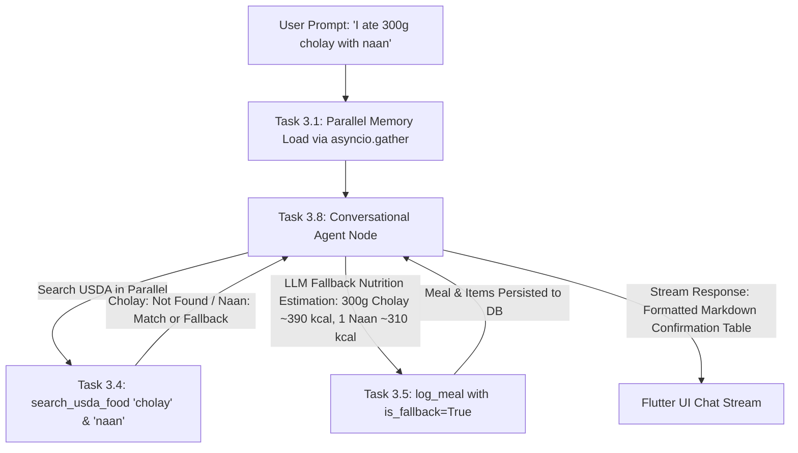

# Technical Specification: Phase 3 — LangGraph Workflow 2 (Conversational CRUD, Text Meal Logging, Non-Blocking Parallel Dual Memory, Regional Dish LLM Fallback, Action Status Streaming & Ultra-Low Latency Architecture)

**Task ID:** Phase 3 (Tasks 3.1 through 3.10)  
**Title:** Conversational Agent with Non-Blocking Parallel Dual Memory, Regional Dish LLM Fallback, Real-Time Action Status Streaming, Concurrent USDA Tools, and Ultra-Low Latency Architecture  
**Feature Branch:** `feature/phase-3-langgraph-workflow-2`  
**Status:** In Specification  

---

## 1. Executive Goal & Architectural Overview

Phase 3 builds **Workflow 2: Conversational CRUD, Text Meal Logging & Dual-Memory Agent**, the primary interactive intelligence engine for Project Bite. It allows users to log meals naturally via text (e.g. *"I ate 2 eggs and one half plate of boiled rice"*, *"Add yesterday dinner I ate 0.5kg fried chicken"*, or *"I ate 300g cholay with naan"*), view daily nutrient analytics, update past logs, and receive personalized coaching based on long-term memory.

### Key Architectural Pillars:

1. **Regional Dish & Unmatched Food LLM Fallback Estimation:**  
   For traditional, cultural, or mixed dishes that may not exist in the USDA FoodData Central database (e.g. *cholay / chana masala*, *biryani*, *nihari*, *naan*, *roti*):
   - When `search_usda_food` returns no match or low confidence, the agent **never fails or crashes**.
   - Instead, the agent automatically falls back to its internal culinary nutritional knowledge to estimate portion weights, calories, and macronutrients (e.g., 300g cholay $\approx 390\text{ kcal}$, 1 naan $\approx 310\text{ kcal}$).
   - The meal is persisted to PostgreSQL via `log_meal` with `is_fallback: true`, and the agent transparently confirms the estimated values to the user.

2. **Non-Blocking Parallel Dual-Memory Architecture:**
   - **Parallel Memory Reads (`asyncio.gather`):** Long-term user facts and short-term conversation checkpoints are loaded concurrently in parallel at request start (saving 50ms DB wait time).
   - **Background Long-Term Fact Extraction (`asyncio.create_task`):** Fact extraction runs as a non-blocking background task (saving 400ms on the critical path).
   - **Short-Term Memory Window & Auto-Summarizer:** When message count exceeds 10 user messages, the latest 2–4 messages remain intact in the active list while older messages are summarized asynchronously in the background.

3. **Real-Time Action Status Streaming (`astream_events` v2):**  
   Emits live **Action Status** events over SSE to Flutter (e.g., *"Estimating portions for 300g cholay & 1 naan..."*, *"Checking USDA database & estimating regional nutrition..."*, *"Saving to your log..."*) before final text tokens stream.

4. **Concurrent USDA Tool Execution (`asyncio.gather`):**  
   Multi-item searches execute concurrently in parallel using `asyncio.gather()`, capping total API wait time at $\max(\text{latency})$.

5. **Performance & Low-Latency Core:**  
   Built with non-blocking `async`/`await`, connection pooling (`AsyncConnectionPool`), in-memory LRU caching (`cachetools`), Pydantic v2 schemas (`extra='forbid'`), and Server-Sent Events (SSE) streaming (`astream_events`).

---

## 2. Execution Trace: Regional Dish LLM Fallback (e.g. *"300g Cholay with Naan"*)

### Detailed Trace:
1. **User Input:** *"I ate 300g cholay with naan"*
2. **Portion & Item Parsing:**
   - Item 1: `Cholay (Chana Masala)`, weight: `300g`
   - Item 2: `Naan (Flatbread)`, portion: `1 piece` $\approx 120\text{g}$
3. **Tool Invocation (`search_usda_food`):**
   - Query 1: `cholay` $\rightarrow$ No official USDA Foundation entry found (returns `None` / `[]`).
   - Query 2: `naan` $\rightarrow$ FDC ID 172900 (or fallback if unmatched).
4. **LLM Fallback Estimation:**
   - Cholay (300g chickpea curry): ~390 kcal, 15.0g protein, 54.0g carbs, 12.0g fat.
   - Naan (120g flatbread): ~310 kcal, 9.0g protein, 52.0g carbs, 6.0g fat.
   - Combined Total: ~700 kcal, 24.0g protein, 106.0g carbs, 18.0g fat.
5. **Database Persistence (`log_meal`):**
   - Persists items with `is_fallback: true` and `fdc_id: null` into `public.meal_items` and `public.meal_logs`.
6. **Confirmation Message:**
   - Responds: *"Logged 300g Cholay with 1 Naan! (Estimated nutrition: ~700 kcal | 24g Protein | 106g Carbs | 18g Fat)."*

---

## 3. Educational Deep-Dive: Core Performance Concepts

---

### A. Concept 1: Non-Blocking Background Tasks (`asyncio.create_task`)
Schedules independent work (e.g. long-term fact extraction and short-term history summarization) to run asynchronously on the event loop without delaying active user response streaming.

---

### B. Concept 2: Real-Time Action Status Event Streaming (`astream_events`)
LangGraph `astream_events` hooks into `on_tool_start` and `on_tool_end` to emit human-readable status JSON chunks over SSE to the client before text tokens stream.

---

### C. Concept 3: In-Memory LRU Caching (`cachetools`)
RAM cache keeping common foods in memory, reducing lookup time from $400\text{ms} \rightarrow 0.05\text{ms}$.

---

### D. Concept 4: Async Database Connection Pooling (`psycopg_pool`)
Pre-warmed connection pool reducing DB connection overhead from $100\text{ms} \rightarrow 1\text{ms}$.

---

### E. Concept 5: Parallel Execution with `asyncio.gather`
Fires multiple async operations concurrently in parallel for memory pre-fetch and multi-item USDA queries.

---

## 4. Complete 10-Subtask Implementation Plan

---

### Task 3.1: DB Connection Pool & Parallel Memory Infrastructure
- **File:** `app/services/langgraph/checkpointer.py`
- **Goal:** Set up `AsyncPostgresSaver` connected to `AsyncConnectionPool` (`app.db.connection.pool`) with parallel read utilities (`asyncio.gather`).

---

### Task 3.2: Short-Term Memory Manager & Non-Blocking Background Summarizer
- **File:** `app/services/langgraph/memory_short_term.py`
- **Goal:** Window trimmer (retains latest 2–4 messages) and async background auto-summarizer when message count exceeds 10 user messages.

---

### Task 3.3: Non-Blocking Long-Term Memory Extractor & Direct Context Injector
- **File:** `app/services/langgraph/memory_long_term.py`
- **Goal:** Background long-term fact extractor (`asyncio.create_task`) and direct profile context injector (<0.1ms).

---

### Task 3.4: Concurrent USDA API Tool with In-Memory LRU Cache & Fallback Handlers
- **File:** `app/services/langgraph/usda_tool.py`
- **Goal:** Build `search_usda_food` tool with `cachetools.TTLCache`, `asyncio.gather()`, and clean fallback response for unmatched items.

---

### Task 3.5: Scoped Database CRUD & Micronutrient Analytics Tools
- **File:** `app/services/langgraph/db_tools.py`
- **Goal:** Implement 5 tenant-isolated database tools (`log_meal`, `get_daily_summary`, `get_micronutrient_total`, `update_meal_item`, `delete_meal_log`) with support for `is_fallback` entries.

---

### Task 3.6: Action Status SSE Streamer & Pydantic v2 Schemas
- **File:** `app/services/langgraph/action_status_streamer.py` & `app/schemas/agent_schemas.py`
- **Goal:** Map `astream_events` to user-facing status SSE JSON chunks and define strict Pydantic v2 schemas (`extra='forbid'`).

---

### Task 3.7: Agent System Prompt with Temporal, Memory, Regional Fallback & Grounding
- **File:** `app/services/langgraph/agent_prompts.py`
- **Goal:** Author system prompt containing temporal context, portion estimation, regional dish fallback rules (*"cholay with naan"*), and grounding guardrails (*"laptop" / "elephant"*).

---

### Task 3.8: Conversational State Graph & Multi-Tool Router Assembly
- **File:** `app/services/langgraph/agent_graph.py`
- **Goal:** Assemble all nodes into a compiled `StateGraph` with checkpointer and SSE streaming engine.

---

### Task 3.9: Integration Test 1 (Meal Addition, Regional Fallback, Concurrent USDA & Action Status)
- **File:** `tests/test_agent_workflow2_logging.py`
- **Goal:** Test natural language meal addition for both standard foods (*eggs, rice*) and regional fallback foods (*cholay with naan*), verifying database logging and action status events.

---

### Task 3.10: Integration Test 2 (Micronutrient Analytics & Background Memory)
- **File:** `tests/test_agent_workflow2_analytics.py`
- **Goal:** Test JSONB micronutrient aggregation, background long-term memory extraction, and short-term window summarization (>10 messages).

---

## 5. Summary Table: 10 Subtasks Overview

| Subtask | Name | Primary Focus | Key Technology |
|---|---|---|---|
| **3.1** | DB Pool & Checkpointer | Parallel Memory Reads | `AsyncPostgresSaver` + `asyncio.gather` |
| **3.2** | Short-Term Memory | Background Auto-Summarize (>10 msgs) | LangGraph Window Trimmer |
| **3.3** | Long-Term Memory | Background Fact Extractor | `asyncio.create_task` + JSONB |
| **3.4** | Concurrent USDA Tool | Parallel Search & Fallback Handlers | `asyncio.gather` + `cachetools` |
| **3.5** | Scoped DB CRUD & Analytics | Tenant-Isolated Meal Ops (`is_fallback`) | Parameterized SQL + GIN JSONB |
| **3.6** | Action Status SSE Streamer | Live Progress Updates | `astream_events` v2 Protocol |
| **3.7** | Agent System Prompt | Regional Fallbacks & Grounding | Dynamic Context Prompting |
| **3.8** | Graph Assembly | Routing & SSE Streaming | `StateGraph` + `astream_events` |
| **3.9** | Integration Test 1 | Meal Addition, Regional Fallback & Status | `pytest-asyncio` |
| **3.10** | Integration Test 2 | Analytics & Memory Summarization | `pytest-asyncio` |
