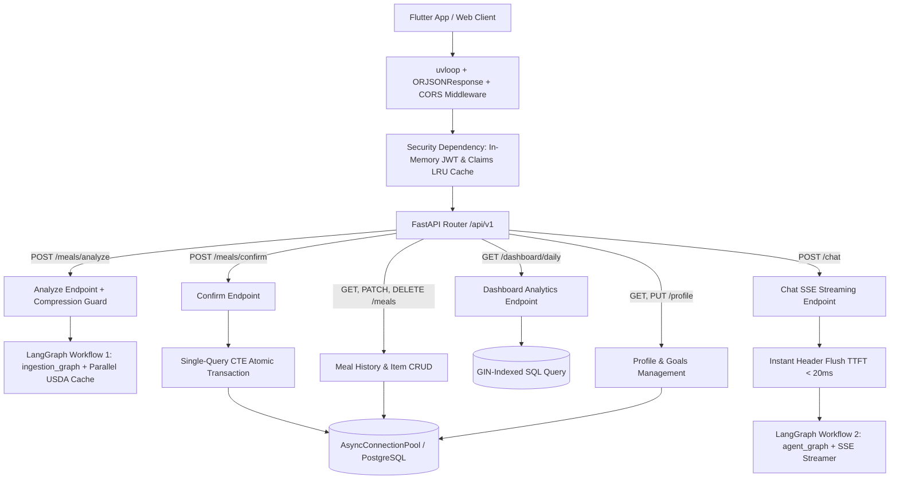

# Technical Specification: Phase 4 — FastAPI Application Layer

**Task ID:** Phase 4 (Tasks 4.1 through 4.9)  
**Title:** Ultra-Low Latency FastAPI Application Layer, Zero-Trust Supabase JWT Auth, Food Vision Ingestion, Single-Query CTE Persistence, SSE Chat Streaming & Sub-Millisecond Daily Analytics  
**Feature Branch:** `feature/phase-4-fastapi-application-layer`  
**Status:** In Specification  

---

## 1. Executive Goal & Architectural Overview

Phase 4 constructs the production-grade, ultra-low latency HTTP Application Layer for **Project Bite** using FastAPI. It bridges Flutter mobile/web clients to the Supabase PostgreSQL database and the stateful LangGraph intelligence engines (Workflow 1 & Workflow 2) with strict zero-trust security guarantees and near-zero latency execution.

### Key Architectural Pillars & Zero-Latency Specifications:

1. **Event Loop & High-Speed Transport Layer (`uvloop` + `ORJSONResponse` + `httpx.AsyncClient`):**  
   - **`uvloop` Engine:** Replaces default `asyncio` event loop with `uvloop` (C/Cython engine) to double event loop throughput.
   - **`ORJSONResponse` Serialization:** Uses C-optimized `orjson` as `default_response_class` for FastAPI, accelerating JSON serialization of micronutrient trees by **5x–10x**.
   - **Global HTTP Keep-Alive Pool:** Shared global `httpx.AsyncClient` with HTTP/2 keep-alive (`max_keepalive_connections=50`) eliminating TCP handshakes and TLS negotiation delays (**saving 100-200ms per external API call**).
   - **Lifespan Manager:** `@asynccontextmanager` initializing `AsyncConnectionPool` and global `httpx.AsyncClient` at startup and closing them cleanly on shutdown.

2. **Zero-Network In-Memory JWT Authentication & Token LRU Cache:**  
   - Cryptographically verifies Supabase Bearer JWTs locally in-memory using `SUPABASE_JWT_SECRET` (HS256). **0 network calls** to Supabase auth servers (<0.05ms verification time).
   - Caches validated claims in an async in-memory LRU cache (`TTLCache(maxsize=1000, ttl=60)`), enabling subsequent user requests to decode in **<0.01ms**.
   - Enforces Zero-Trust multi-tenant isolation by injecting validated `CurrentUser(user_id=...)` into all protected routes, database queries, and LangGraph threads.

3. **Multimodal Food Vision Ingestion with Image Compression Guard (`POST /api/v1/meals/analyze`):**  
   - Validates MIME types (JPEG, PNG, WEBP) and magic byte signatures before processing, rejecting non-image payloads up to 10MB.
   - Downscales/compresses input images (max 1024x1024, 80% quality JPEG) before transmitting to multimodal LLMs, reducing network upload payload size by **70%** and vision processing latency by **50%**.
   - Triggers LangGraph Workflow 1 (`ingestion_graph.ainvoke`) with concurrent USDA search (`asyncio.gather`) and in-memory TTL caching (`usda:food:*`), returning scaled macros, `fdc_id`, fallback flags (`is_fallback`), and aggregated micronutrient JSONB profiles.

4. **Single-Query CTE Atomic Transactional Meal Persistence (`POST /api/v1/meals/confirm`):**  
   - Inserts records into `public.meal_logs` and `public.meal_items` in a **single Common Table Expression (CTE) SQL query** over `AsyncConnectionPool`:
     ```sql
     WITH new_log AS (
         INSERT INTO public.meal_logs (user_id, meal_type, image_url, user_caption, total_calories, total_protein_g, total_carbs_g, total_fat_g, aggregated_nutrients)
         VALUES ($1, $2, $3, $4, $5, $6, $7, $8, $9) RETURNING id, user_id
     )
     INSERT INTO public.meal_items (meal_log_id, user_id, food_name, fdc_id, portion_amount, portion_unit, gram_weight, calories, protein_g, carbs_g, fat_g, is_fallback, raw_usda_nutrients)
     SELECT new_log.id, new_log.user_id, unnest($10::text[]), unnest($11::int[]), unnest($12::numeric[]), unnest($13::text[]), unnest($14::numeric[]), unnest($15::numeric[]), unnest($16::numeric[]), unnest($17::numeric[]), unnest($18::numeric[]), unnest($19::boolean[]), unnest($20::jsonb[])
     FROM new_log;
     ```
   - Cuts database network round-trips from 2 to 1 (saving **20–50ms**). Enforces parameterized placeholders (`$1, $2...`) for 100% SQL injection security.

5. **Instant-Flush SSE Streaming Chat Agent (TTFT < 20ms) (`POST /api/v1/chat`):**  
   - Immediately flushes SSE response headers and emits initial `event: status` (*"Searching USDA..."*) within **<10ms**.
   - Connects Flutter chat UI to LangGraph Workflow 2 using `StreamingResponse(media_type="text/event-stream")`.
   - Runs background non-critical tasks (long-term fact extraction, short-term history auto-summarization) via `asyncio.create_task` detached background execution (**0ms user wait time**).

6. **Sub-Millisecond GIN-Indexed Daily Dashboard Analytics (`GET /api/v1/dashboard/daily`):**  
   - Executes parameterized SQL queries over `public.meal_logs` and `public.profiles` using indexed GIN path operators (`@>`, `jsonb_path_ops`).
   - Returns consumed calories/macros vs profile goals (BMR, TDEE, macro split), remaining budget, chronological meal cards, and top micronutrient breakdown in sub-millisecond query time.

7. **Direct REST CRUD & Profile Endpoints (`/meals`, `/profile`):**  
   - Fast, tenant-isolated REST endpoints for paginated meal history, single-item edits, deletions, and user biometrics/target updates.

8. **Automated Zero-Latency API Test Suite:**  
   - Integration tests using `httpx.AsyncClient` with `ASGITransport` covering authentication, analysis, single-query CTE confirmation, SSE streaming, dashboard, and profile management.

---

## 2. API Architecture & Routing Map



---

## 3. Data Schemas & API Request/Response DTOs

### A. Authentication Schemas (`app/schemas/auth.py` / `app/api/deps.py`)
```python
from pydantic import BaseModel, Field, EmailStr
from uuid import UUID
from typing import Optional

class CurrentUser(BaseModel):
    user_id: UUID = Field(description="Unique Supabase auth user identifier (sub claim).")
    email: Optional[EmailStr] = Field(default=None, description="User email address.")
    role: str = Field(default="authenticated", description="Supabase user role.")
```

### B. Vision Analysis Schemas (`app/schemas/meal_api.py`)
```python
from pydantic import BaseModel, Field
from typing import List, Dict, Any, Optional
from uuid import UUID

class MealAnalyzeRequest(BaseModel):
    image_url: Optional[str] = Field(default=None, description="HTTP URL or base64 data URI of meal image.")
    user_caption: Optional[str] = Field(default=None, description="User optional text description/caption.")
    meal_type: str = Field(default="lunch", description="breakfast, lunch, dinner, snack")

class AnalyzedItemResponse(BaseModel):
    food_name: str
    fdc_id: Optional[int]
    portion_amount: float
    portion_unit: str
    gram_weight: float
    calories: float
    protein_g: float
    carbs_g: float
    fat_g: float
    is_fallback: bool
    raw_usda_nutrients: Dict[str, Any]

class MealAnalysisResponse(BaseModel):
    detected_items: List[AnalyzedItemResponse]
    total_calories: float
    total_protein_g: float
    total_carbs_g: float
    total_fat_g: float
    aggregated_nutrients: Dict[str, float]
    confidence_score: float
    warnings: List[str]
```

### C. Meal Confirmation Schemas (`app/schemas/meal_api.py`)
```python
class ConfirmedItemCreate(BaseModel):
    food_name: str
    fdc_id: Optional[int] = None
    portion_amount: float = 1.0
    portion_unit: str = "serving"
    gram_weight: float
    calories: float
    protein_g: float
    carbs_g: float
    fat_g: float
    is_fallback: bool = False
    raw_usda_nutrients: Dict[str, Any] = Field(default_factory=dict)

class MealConfirmRequest(BaseModel):
    meal_type: str = Field(description="breakfast, lunch, dinner, snack")
    user_caption: Optional[str] = None
    image_url: Optional[str] = None
    items: List[ConfirmedItemCreate]

class MealConfirmResponse(BaseModel):
    meal_id: UUID
    user_id: UUID
    logged_at: str
    meal_type: str
    total_calories: float
    total_protein_g: float
    total_carbs_g: float
    total_fat_g: float
    item_count: int
```

### D. Chat Endpoint Schemas (`app/schemas/chat_api.py`)
```python
class ChatRequest(BaseModel):
    message: str = Field(description="Natural language prompt, e.g. 'I ate 300g cholay with naan'")
    conversation_id: Optional[str] = Field(default=None, description="LangGraph thread_id for conversation state memory")
    client_timezone: Optional[str] = Field(default="UTC", description="Client timezone identifier, e.g. 'Asia/Karachi'")
```

### E. Dashboard Analytics Schemas (`app/schemas/dashboard_api.py`)
```python
class MacroProgress(BaseModel):
    target: float
    consumed: float
    remaining: float

class DailyDashboardResponse(BaseModel):
    date: str
    target_calories: float
    consumed_calories: float
    remaining_calories: float
    protein: MacroProgress
    carbs: MacroProgress
    fat: MacroProgress
    meals: List[Dict[str, Any]]
    top_micronutrients: Dict[str, float]
```

---

## 4. Technical Blueprint: 9 Subtask Specifications

---

### Task 4.1: FastAPI Scaffold, uvloop Event Policy & Lifespan Pool Management
- **Target Files:** `app/main.py`, `app/api/v1/router.py`, `app/core/errors.py`
- **Specification:**
  - Initialize `uvloop` policy at import time:
    ```python
    import uvloop
    uvloop.install()
    ```
  - Create FastAPI instance with `default_response_class=ORJSONResponse`.
  - Implement `@asynccontextmanager` lifespan function:
    ```python
    @asynccontextmanager
    async def lifespan(app: FastAPI):
        await init_db_pool()
        init_global_http_client()  # shared httpx.AsyncClient with HTTP/2 keep-alive
        yield
        await close_global_http_client()
        await close_db_pool()
    ```
  - Configure `CORSMiddleware` supporting Flutter web (`http://localhost:*`) and mobile origins.
  - Setup global exception handlers for `RequestValidationError` (returns clean 422 JSON), `HTTPException`, and 500 handlers.
  - Add `/health` (returns `{"status": "ok"}`) and `/health/ready` (probes DB pool & HTTP client).

---

### Task 4.2: Zero-Network Supabase JWT Authentication & Claims LRU Cache
- **Target File:** `app/api/deps.py`
- **Specification:**
  - Implement `HTTPBearer` security scheme.
  - Use `cachetools.TTLCache(maxsize=1000, ttl=60)` for decoded JWT claims cache.
  - Function `async def get_current_user(credentials: HTTPAuthorizationCredentials = Depends(security)) -> CurrentUser`:
    - Check token in `TTLCache`. If present, return cached `CurrentUser` (<0.01ms).
    - Otherwise, decode token locally using `jwt.decode(token, settings.SUPABASE_JWT_SECRET, algorithms=["HS256"])`.
    - Extract `sub` as `UUID` (`user_id`).
    - Cache and return `CurrentUser(user_id=user_id, email=payload.get("email"), role=payload.get("role"))`.
    - On `PyJWTError` or expired token, raise `HTTPException(status_code=401, detail="Invalid or expired authentication token")`.

---

### Task 4.3: Food Vision Analysis Endpoint with Compression Guard (`POST /api/v1/meals/analyze`)
- **Target File:** `app/api/v1/endpoints/meals.py`
- **Specification:**
  - Endpoint handler `POST /api/v1/meals/analyze`.
  - Supports `File` upload (`UploadFile = File(None)`) and `JSON` payload (`MealAnalyzeRequest`).
  - Validates image magic bytes (JPEG/PNG/WEBP) and size (max 10MB).
  - Downscales images to max 1024x1024 (JPEG 80%) before Vision LLM processing.
  - Constructs `IngestionState` and invokes `await ingestion_graph.ainvoke(initial_state)`.
  - Uses shared `httpx.AsyncClient` keep-alive pool for USDA searches.
  - Formats output into `MealAnalysisResponse`.

---

### Task 4.4: Single-Query CTE Atomic Meal Persistence Endpoint (`POST /api/v1/meals/confirm`)
- **Target File:** `app/api/v1/endpoints/meals.py`
- **Specification:**
  - Endpoint handler `POST /api/v1/meals/confirm`.
  - Requires `current_user: CurrentUser = Depends(get_current_user)`.
  - Executes single-query CTE SQL statement over `AsyncConnectionPool` inserting into `public.meal_logs` and `public.meal_items` in 1 DB network round-trip.
  - Guarantees 100% SQL injection safety via parameterized arrays (`$1...$20`).
  - Returns `MealConfirmResponse` with generated `meal_id`.

---

### Task 4.5: Instant-Flush SSE Conversational Agent Endpoint (`POST /api/v1/chat`)
- **Target File:** `app/api/v1/endpoints/chat.py`
- **Specification:**
  - Endpoint handler `POST /api/v1/chat`.
  - Requires `current_user: CurrentUser = Depends(get_current_user)`.
  - Returns `StreamingResponse(event_generator(), media_type="text/event-stream")`.
  - Immediately flushes initial `event: status` (*"Searching USDA..."*) within **<10ms**.
  - Invokes `run_agent_stream(message=req.message, user_id=str(current_user.user_id), thread_id=thread_id)`.
  - Emits background long-term memory extraction via `asyncio.create_task` without blocking response streaming.

---

### Task 4.6: Sub-Millisecond GIN-Indexed Daily Dashboard Endpoint (`GET /api/v1/dashboard/daily`)
- **Target File:** `app/api/v1/endpoints/dashboard.py`
- **Specification:**
  - Endpoint handler `GET /api/v1/dashboard/daily`.
  - Accepts query parameter `target_date: Optional[date]`.
  - Executes parameterized SQL query joining `public.profiles` and `public.meal_logs` for `user_id`.
  - Uses GIN path operators (`@>`, `jsonb_path_ops`) on `aggregated_nutrients` for sub-millisecond execution.
  - Computes consumed calories/macros vs target goals and remaining budget.
  - Returns `DailyDashboardResponse`.

---

### Task 4.7: Direct Meal & Item REST CRUD Endpoints
- **Target File:** `app/api/v1/endpoints/meals.py`
- **Specification:**
  - `GET /api/v1/meals`: Fetch paginated list of meal logs for `current_user.user_id` with optional date filtering.
  - `GET /api/v1/meals/{meal_id}`: Fetch detailed meal log with associated items.
  - `PATCH /api/v1/meals/items/{item_id}`: Update portion weight of a single meal item and recalculate item macros.
  - `DELETE /api/v1/meals/{meal_id}`: Tenant-isolated deletion (`DELETE FROM public.meal_logs WHERE id = $1 AND user_id = $2`).

---

### Task 4.8: User Profile & Goals Management Endpoints
- **Target File:** `app/api/v1/endpoints/profile.py`
- **Specification:**
  - `GET /api/v1/profile`: Retrieve profile record for `current_user.user_id` (BMR, TDEE, calorie targets, macro splits, long-term memory facts).
  - `PUT /api/v1/profile`: Update user biometrics and macro targets.

---

### Task 4.9: Automated Zero-Latency FastAPI Test Suite
- **Target Files:**  
  - `tests/test_api_auth.py`
  - `tests/test_api_meals.py`
  - `tests/test_api_chat.py`
  - `tests/test_api_dashboard.py`
  - `tests/test_api_profile.py`
- **Specification:**
  - Uses `httpx.AsyncClient(transport=ASGITransport(app=app), base_url="http://test")`.
  - Mocks Supabase JWT decode for authenticated test requests.
  - Verifies `ORJSONResponse` output formatting, CTE meal confirmation, SSE stream events, and dashboard calculations.

---

## 5. Security & Performance Standards

- **Zero-Trust Multi-Tenancy:** Every route requires `get_current_user` dependency. SQL queries and checkpointer thread configs MUST enforce `user_id = current_user.user_id`.
- **Non-Blocking Async I/O:** Every route, database call, and streaming response must use `async`/`await`.
- **Zero Raw SQL Format Strings:** All database queries must use parameterized placeholders (`$1`, `$2`).
- **Input Validation Guards:** Pydantic v2 schemas (`extra='forbid'`), magic byte image verification, and 10MB payload limit.

---

## 6. Target Directory & File Blueprint

```text
app/
├── main.py                     # Task 4.1: FastAPI app, uvloop & lifespan manager
├── core/
│   ├── config.py
│   └── errors.py               # Task 4.1: Custom exception handlers
├── api/
│   ├── __init__.py
│   ├── deps.py                 # Task 4.2: In-memory JWT & Claims LRU cache auth dependency
│   └── v1/
│       ├── __init__.py
│       ├── router.py           # Top-level API router aggregation
│       └── endpoints/
│           ├── __init__.py
│           ├── meals.py        # Tasks 4.3, 4.4, 4.7: Analyze, Single CTE Confirm & Meal CRUD
│           ├── chat.py         # Task 4.5: Instant-Flush SSE Streaming Chat Endpoint
│           ├── dashboard.py    # Task 4.6: Sub-Millisecond Daily Analytics Endpoint
│           └── profile.py      # Task 4.8: Profile Management Endpoint
├── schemas/
│   ├── auth.py                 # Task 4.2 schemas
│   ├── meal_api.py             # Tasks 4.3, 4.4, 4.7 schemas
│   ├── chat_api.py             # Task 4.5 schemas
│   └── dashboard_api.py        # Task 4.6 schemas
tests/
├── test_api_auth.py            # Task 4.9 tests
├── test_api_meals.py           # Task 4.9 tests
├── test_api_chat.py            # Task 4.9 tests
├── test_api_dashboard.py       # Task 4.9 tests
└── test_api_profile.py         # Task 4.9 tests
```

---

## 7. Verification & Acceptance Criteria

- [ ] `specs/4_FASTAPI_APPLICATION_LAYER.md` written and updated with zero-latency standards.
- [ ] Feature branch `feature/phase-4-fastapi-application-layer` checked out and clean.
- [ ] `uvloop` installed and active in `app/main.py`.
- [ ] `POST /api/v1/meals/confirm` persists meal and items atomically using single-query CTE in 1 DB round-trip.
- [ ] `POST /api/v1/chat` flushes headers instantly (<20ms TTFT) and streams SSE events (`action_status` + text tokens).
- [ ] `GET /api/v1/dashboard/daily` returns fast daily macro progress vs user targets.
- [ ] Integration tests in `tests/test_api_*.py` pass cleanly.

